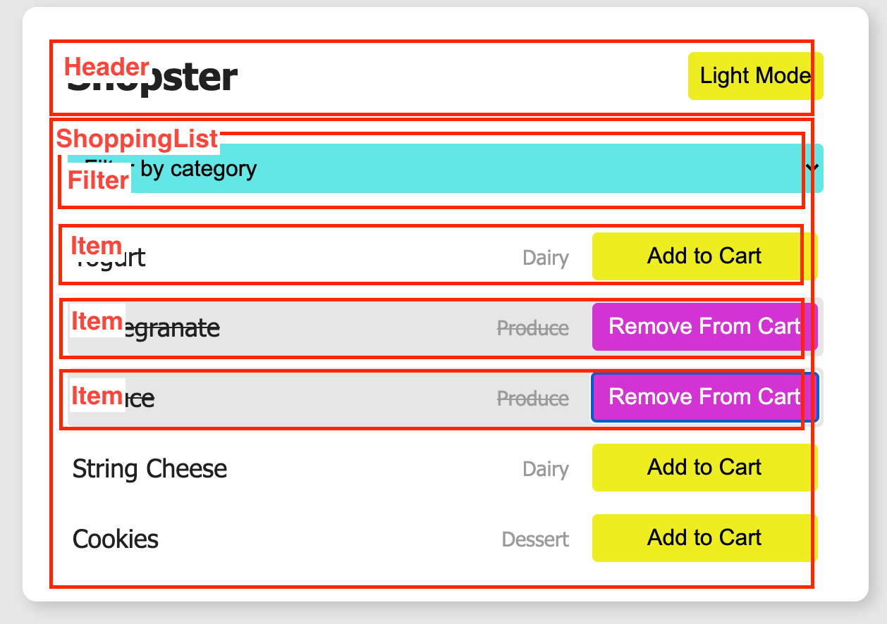

# React Information Flow Lab

## Overview

Last time we worked on the Shopping List app, we ended up with the following
component hierarchy:

```
App
└── ShoppingList
    ├── Item
    ├── Item
    └── Item
```

However, it would probably make more sense to break the app down more like this:



```
App
├── Header
└── ShoppingList
    ├── Filter
    ├── Item
    ├── Item
    └── Item
```

Your goal is to refactor the code from the previous lab to match the component
structure in the image above. As you work on refactoring the code, keep in mind:

- Which components should hold **state**? Which components need access to that state?
- How can we update state in one component from a child component?

Also, remember what we learned in the previous lesson:

- For information to propagate _down_ the component tree, parents pass `props`
  to their children
- For information to propagate _up_ the component tree, we typically invoke
  callbacks that were passed from parents to children as `props`
- Components of the same level (sibling components) cannot communicate directly!
  We can only communicate up and down the component tree. So if multiple
  components need to share the same information, that state should live in the
  parent (or a more general ancestor) component.

## Deliverables

### Header

Create a `Header` component by refactoring the `<header>` element out of the
`App` component. Clicking on the `<button>` inside of the `Header` component
should still toggle dark mode on and off.

### Filter

Create a `Filter` component by refactoring the `<select>` element out of the
`ShoppingList` component. Changing the selection in the dropdown should still
change which items are displayed in the shopping list.

## Resources

- [React Docs on `useState`](https://reactjs.org/docs/hooks-state.html)
